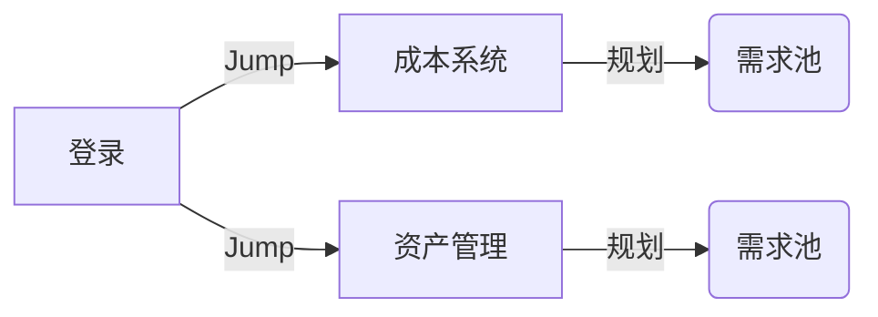
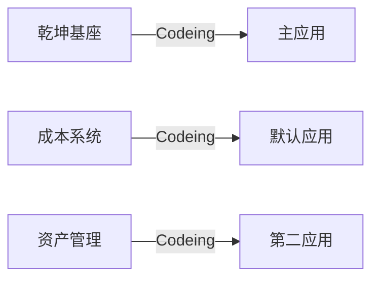

## 项目介绍 

- 需求规划流程

- 需求开发流程

-----
## 项目功能介绍 

- 乾坤基座
乾坤系统开发基座
登录
- 成本系统（React）
技术栈：React、abtd
融合乾坤
- 资产管理（Vue）
技术栈：vue

------
### 接口数据

-  公共部分
-  成本管理
-  资产管理

-----
### 知识沉淀
- 马聪
- 梁杜
- 张字永

## 学习路线：
- 巩固Vue、
- 巩固React、
- 学习乾坤框架、
- 学习NodeJs、
- 实现前后端自主实现

## 日报
- 乾坤融合日报 https://docs.qq.com/sheet/DTXdLVWJZZmZaWk9q?tab=bx1ge6) 

